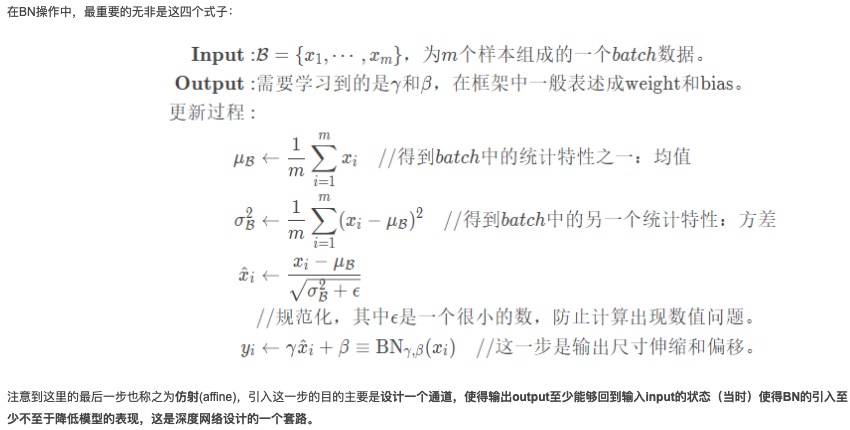

# 210429_YoloV3_Experiment

---

# 从 YoloV3 源码中进阶 Pytorch

pytorch == 1.6.0（nms 需要）

TODO：未处理 config["cuda"] = True 的情况

---

## YoloV3 架构

### DarkNet53 架构


### YoloV3 架构


### YoloV3 前向传播流程图


### YoloV3 正反向传播数据流图


---

## PIL、Numpy 和 Pytorch 基础

### * 和 **

- * 解引用 tuple
- ** 解引用 dict

```python
def fun(*args, **kwargs):
    print(args)
    print(kwargs)


a = (1, 3)
b = {"key1": 1, "key2": "value"}

# 1. 函数形参
fun(a, b)
"""
((1, 3), {"key1": 1, "key2": "value"})
{}
"""

# 1. 函数形参
fun(*a, b=b)
"""
(1, 3)
{"b": {"key1": 1, "key2": "value"}}
"""

# 2. 函数实参
fun(*a, **b)
"""
(1, 3)
{"key1": 1, "key2": "value"}
"""

# 3. 序列解包
a, b, *c = 1, 2, 3, 4
print(c)
"""
[3, 4]
"""
```

### Tensor.repeat()

```python
>>> import torch
>>> 
>>> # 定义一个 33x55 张量
>>> a = torch.randn(33, 55)
>>> a.size()
torch.Size([33, 55])
>>> 
>>> # 下面开始尝试 repeat 函数在不同参数情况下的效果
>>> a.repeat(1,1).size()     # 原始值：torch.Size([33, 55])
torch.Size([33, 55])
>>> 
>>> a.repeat(2,1).size()     # 原始值：torch.Size([33, 55])
torch.Size([66, 55])
>>> 
>>> a.repeat(1,2).size()     # 原始值：torch.Size([33, 55])
torch.Size([33, 110])
>>>
>>> a.repeat(1,1,1).size()   # 原始值：torch.Size([33, 55])
torch.Size([1, 33, 55])
>>>
>>> a.repeat(2,1,1).size()   # 原始值：torch.Size([33, 55])
torch.Size([2, 33, 55])
>>>
>>> a.repeat(1,2,1).size()   # 原始值：torch.Size([33, 55])
torch.Size([1, 66, 55])
>>>
>>> a.repeat(1,1,2).size()   # 原始值：torch.Size([33, 55])
torch.Size([1, 33, 110])
>>>
>>> a.repeat(1,1,1,1).size() # 原始值：torch.Size([33, 55])
torch.Size([1, 1, 33, 55])
>>> 
>>> # ------------------ 割割 ------------------
>>> # repeat()的参数的个数，不能少于被操作的张量的维度的个数，
>>> # 下面是一些错误示例
>>> a.repeat(2).size()  # 1D < 2D, error
Traceback (most recent call last):
  File "<stdin>", line 1, in <module>
RuntimeError: Number of dimensions of repeat dims can not be smaller than number of dimensions of tensor
>>>
>>> # 定义一个3维的张量，然后展示前面提到的那个错误
>>> b = torch.randn(5,6,7)
>>> b.size() # 3D
torch.Size([5, 6, 7])
>>> 
>>> b.repeat(2).size() # 1D < 3D, error
Traceback (most recent call last):
  File "<stdin>", line 1, in <module>
RuntimeError: Number of dimensions of repeat dims can not be smaller than number of dimensions of tensor
>>>
>>> b.repeat(2,1).size() # 2D < 3D, error
Traceback (most recent call last):
  File "<stdin>", line 1, in <module>
RuntimeError: Number of dimensions of repeat dims can not be smaller than number of dimensions of tensor
>>>
>>> b.repeat(2,1,1).size() # 3D = 3D, okay
torch.Size([10, 6, 7])
>>>
```

### PIL.Image.Image 和 Numpy.ndarray

(image_width,image_height) = PIL.Image.Image.size，但是其内部存储是 h * w，通过 numpy.array() 转化为 h * w * rgb

```python
import PIL

im = PIL.Image.open("./images/test0.png") 
width, height = im.size
```

```python
import PIL
import numpy

I = numpy.asarray(PIL.Image.open("./images/test0.png", mode="rb"))
im = PIL.Image.fromarray(numpy.uint8(I))
im = PIL.Image.fromarray(I.astype(numpy.uint8))
```

### Numpy.asarray 和 Numpy.array

array 和 asarray 都可以将结构数据转化为 ndarray，但是主要区别就是当数据源是 ndarray 时，array 仍然会 copy 出一个副本，占用新的内存，但 asarray 不会。

当`I = numpy.asarray(PIL.Image.Image)`时，`I.flags`有：

- OWNDATA : False
- WRITEABLE : False

> You can also get ndarray from PIL.Image with np.asarray(). np.array() returns a rewritable ndarray, while np.asarray() returns a non-rewritable ndarray.

报错：`The given NumPy array is not writeable`，It is caused by `image = transforms.ToTensor()(numpy.asarray(PIL.Image))` 

### torch.as_tensor 和 torch.form_numpy

When a is ndarray, torch.from_numpy(a) is same as torch.as_tensor(a), and they don’t copy the data just share the same memory, but test that from_numpy faster than as_tensor.

Though both approaches share the underlying memory. torch.as_tensor accepts a bit more that torch.from_numpy, such as list objects, and might thus have a slightly higher overhead for these checks.

- 共享 ndarray 存储
- torch.as_tensor 需要额外的检查因此增加了耗时

报错：`only one element tensors can be converted to Python scalars`，转换失败：

- list(tensor) 无法 torch.as_tensor
- ndarray(tensor) 无法 torch.from_numpy

### tensor.detach() 和 tensor.data

在 0.4.0 版本以前，tensor.data 是用来取 Variable 中的 tensor 的，但是之后 Variable 被取消，tensor.data 却留了下来。现在我们调用 tensor.data，可以得到 tensor 的数据 + requires_grad=False 的版本，而且二者共享储存空间，也就是如果修改其中一个，另一个也会变。因为 PyTorch 的自动求导系统不会追踪 tensor.data 的变化，所以使用它的话可能会导致求导结果出错。官方建议使用 tensor.detach() 来替代它，二者作用相似，但是 detach 会被自动求导系统追踪，使用起来很安全。

**使用 tensor.detach()，如果计算导数错误，会报错；而使用 tensor.data，则会返回错误的导数**。

示例：


### tensor.detach() 和 tensor.clone()

- tensor.clone()：返回一个和源张量同shape、dtype和device的张量，与源张量不共享数据内存，但提供梯度的回溯。
- tensor.detach()：即返回一个和源张量同shape、dtype和device的张量，与源张量共享数据内存，但不提供梯度计算，即requires_grad=False，因此脱离计算图。

**clone 和 detach 联合使用**：clone 提供了非数据共享的梯度追溯功能，而 detach 又舍弃了梯度功能，因此 clone 和 detach 意味着着只做简单的数据复制，既不数据共享，也不对梯度共享，从此两个张量无关联。

`.clone().detach()`或`.numpy().copy()`

### torch.Tensor、torch.autograd.Variable 和 torch.nn.parameter.Parameter

#### torch.Tensor 和 torch.autograd.Variable

- 在 0.4.0 版本以前，torch.Tensor 是 torch.autograd.Variable.data，torch.autograd.Variable 是对 torch.Tensor 和自动微分的封装，即包含了 tensor，grad 和 grad_fn。
- 在 0.4.0 版本以后 torch.Tensor = torch.autograd.Variable

#### torch.Tensor 和 torch.nn.parameter.Parameter

- torch.Tensor 默认`requires_grad=False`，torch.nn.parameter.Parameter 默认`requires_grad=True`。
- 优化器可以很方便地获取网络的参数：`optimizer = torch.optim.SGD(net.parameters(), lr=1e-1)`。

> self.v = torch.nn.Parameter(torch.FloatTensor(hidden_size)) 将一个不可训练的类型 Tensor 转换成可以训练的类型 parameter 并将这个 parameter 绑定到这个 module 里面(net.parameter()中就有这个绑定的parameter，所以在参数优化的时候可以进行优化的)，所以经过类型转换这个self.v 变成了模型的一部分，成为了模型中根据训练可以改动的参数了。
> 
> 而 torch.tensor([1,2,3],requires_grad=True)，这个只是将参数变成可训练的，并没有绑定在module的parameter列表中。

### retain_graph

默认`retain_graph=False`，即每次 backward 后清除计算图。

如果同一批 torch.nn.parameter.Parameter 需要在多次反向传播过程中用到，那么在 backward 的时候还要手动注明参数 backward(retain_graph=True)。

最后一次用到时标明`retain_graph=False`清除计算图。

### torch.nn.ModuleList 和 torch.nn.Sequential

#### torch.nn.ModuleList 和 List[torch.nn.Module]

- torch.nn.ModuleList 可以看作 List[torch.nn.Module]，都可以用于计算输出结果。
- torch.nn.ModuleList 会将里面的 Module 自动注册到整个网络上，而 List[torch.nn.Module] 不会。

#### torch.nn.ModuleList 和 torch.nn.Sequential

- torch.nn.Sequential 内部实现了 forward()，torch.nn.ModuleList 需要遍历所有的 forward()。
- torch.nn.Sequential 内部顺序执行，可以使用 collections.OrderedDict() 为每一层命名。（默认 0，1，2）
- torch.nn.Sequential 失去了灵活性，只能整体使用；torch.nn.ModuleList 可以保存中间层的计算结果。
- torch.nn.ModuleList 解包后可以用于创建 torch.nn.Sequential：

```python
import torch.nn

self.linears = torch.nn.Sequential(
    *torch.nn.ModuleList(
        [torch.nn.Linear(10, 10) for i in range(3)]
    )
)
```

### torch.permute()、torch.transpose() 和 numpy.transpose()

- 调用方式：
    - torch.permute()：
        1. Tensor.permute()
    - torch.transpose()：
        1. torch.transpose(Tensor)
        2. Tensor.transpose()
    - numpy.transpose()：
        1. numpy.transpose(ndarray)
        2. ndarray.transpose()
- torch.permute() 可以对任意高维矩阵进行转置；torch.transpose() 只能转置两个维度。
- 连续使用 torch.transpose 也可实现 torch.permute 的效果
    - `torch.randn(2,3,4,5).transpose(3,0).transpose(2,1).transpose(3,2).shape -> torch.Size([5, 4, 2, 3])`
- numpy.transpose() 可以对任意高维矩阵进行转置。

### view() 前调用 contiguous()

contiguous 一般与 transpose，permute，view 搭配使用：使用 transpose 或 permute 进行维度变换后，调用 contiguous，然后方可使用 view 对维度进行变形。

如果 Tensor 不是连续的（**不是内存连续，而是维度连续**），则会重新开辟一块内存空间保证数据是在内存中是连续的，如果 Tensor 是连续的，则 contiguous 无操作。

1. transpose、permute 等维度变换操作后，tensor 在内存中不再是连续存储的，而 view 操作要求 tensor 的内存连续存储，所以需要 contiguous 来返回一个 contiguous copy；
2. 维度变换后的变量是之前变量的浅拷贝，指向同一区域，即 view 操作会连带原来的变量一同变形，这是不合法的，所以也会报错；也即 contiguous 返回了 tensor 的深拷贝 contiguous copy 数据。

> 在使用 transpose() 进行转置操作时，pytorch 并不会创建新的、转置后的 tensor，而是修改了 tensor 中的一些属性（也就是元数据），使得此时的 offset 和 stride 是与转置 tensor 相对应的，而转置的 tensor 和原 tensor的内存是共享的。
> 
> 此时虽然数据存储在内存中是连续的，但是在维度上是不连续的，所以需要先调用 contiguous() 再调用 view()。

### cuda() 和 cpu()

- cuda(): Moves all model parameters and buffers to the GPU.
- cpu(): Moves all model parameters and buffers to the CPU.

GPU tensor 不能直接转为 numpy 数组，必须先转到 CPU tensor：`Tensor.cpu().numpy()`

如果tensor是标量的话，可以直接使用 item() 函数（只能是标量）将值取出来：`Tensor.item()`

### torch.max(input, dim, keepdim=False, *, out=None) -> (Tensor, LongTensor)

> Returns a namedtuple (values, indices) where values is the maximum value of each row of the input tensor in the given dimension dim. And indices is the index location of each maximum value found (argmax).
>
> If keepdim is True, the output tensors are of the same size as input except in the dimension dim where they are of size 1. Otherwise, dim is squeezed (see torch.squeeze()), resulting in the output tensors having 1 fewer dimension than input.

---

## 网络结构设计

### 卷积网络中的感受野

#### 感受野的计算

1. 从后向前计算方法，极其简单适合人脑计算。
2. 从前往后计算方法，比较规律适合电脑计算。

#### 感受野的作用

- 一般 task 要求感受野越大越好，如图像分类中最后卷积层的感受野要大于输入图像，网络深度越深感受野越大性能越好；
- 密集预测 task 要求输出像素的感受野足够的大，确保做出决策时没有忽略重要信息，一般也是越深越好；
- 目标检测 task 中设置 anchor 要严格对应感受野，anchor 太大或偏离感受野都会严重影响检测性能。

#### 理论感受野和实际感受野

实际感受野要小于理论感受野,是在 NIPS2016 中的`Understanding the Effective Receptive Field in Deep Convolutional Neural Networks`提出的。

1. 并不是感受野内所有像素对输出向量的贡献相同，实际感受野是一个高斯分布，有效感受野仅占理论感受野的一部分。


2. 实际感受野线性增长，有效感受野`√n`增长，有效感受野占实际感受野的比例`1/√n`缩减。


3. 训练的过程中，感受野也会发生变化。分类和分割任务经过训练后的感受野都有提升，不过提升幅度不太一样。这也说明了神经网络通过学习，扩大了感受也，能够自适应把越来越大的权重放在感受野之外的像素上。


### 卷积操作

1. 卷积操作中，设置`bias=False`，因为如果卷积操作后要接 BN 操作，则偏置不起作用，且占用显卡内存。

### 激活函数

1. 使用 LeakyReLU 作为激活函数，收敛速度快，梯度不饱和不消失，而且负数区域神经元也不会死掉。

### 批次标准化



函数参数：

- num_features： 来自期望输入的特征数，该期望输入的大小为`batch_size * num_features [* height * width]`
- eps： 为保证数值稳定性（分母不能趋近或取0）,给分母加上的值。默认为1e-5。
- momentum： 动态均值和动态方差所使用的动量。默认为0.1。
    - 代表当前 batch 产生的统计数据的重要性为 0.1，历史数据为 0.9
- affine： 布尔值，当设为true，给该层添加可学习的仿射变换参数，也就是是否需要上面算式的第四个。
- track_running_stats：布尔值，当设为true，记录训练过程中的均值和方差。
    - 当在预测阶段的时候，如果 track_running_stats=False，此时如果 batch_size 比较小，那么其统计特性就会和全局统计特性有着较大偏差，可能导致糟糕的效果。

网络参数：

1. weight 和 bias（训练得到）
2. running_mean 和 running_var（统计得到）
3. num_batches_tracked: （仅在训练使用）
    1. 训练时用来统计训练时的 forward 过的 min-batch 数目，每经过一个 min-batch, num_batches_tracked+=1
    2. 如果没有指定 momentum, 则使用 1/num_batches_tracked 作为因数来计算均值和方差

---

## 损失函数设计

### 交叉熵损失函数：torch.nn.BCELoss()

[参考文章：损失函数 - 交叉熵损失函数](https://zhuanlan.zhihu.com/p/35709485)


---

## 训练方法设计

### train() 和 eval()

model.eval()，pytorch 会自动把 BN 和 DropOut 固定住，不会取平均，而是用训练好的值。不然的话，一旦 test 的 batch_size 过小，很容易就会被 BN 层导致生成图片颜色失真极大；

在模型测试阶段使用 model.train() 让 model 变成训练模式，此时 dropout 和 batch normalization 的操作在训练中起到防止网络过拟合的作用。

- model.eval() 会固定 BN 的 running_mean 和 running_var 参数。

### 预训练权重根据模型结构修改名称

```python
from collections import OrderedDict

import torch

if __name__ == "__main__":
    # weights_name = "yolov3"
    weights_name = "darknet53"

    # 读取原始权重列表
    raw_weights_file = open("./raw_" + weights_name + "_weights_state_dict.txt", "r")
    raw_weights_lines = raw_weights_file.readlines()
    print("raw_weights_lines:", len(raw_weights_lines))
    # 读取新的权重列表
    demo_weights_file = open("./demo_" + weights_name + "_weights_state_dict.txt", "r")
    demo_weights_lines = demo_weights_file.readlines()
    print("demo_weights_lines:", len(demo_weights_lines))
    # 去除无效映射
    demo_weights_lines = [line for line in demo_weights_lines if not "num_batches_tracked" in line]
    print("demo_weights_lines:", len(demo_weights_lines))
    # 去除末尾换行
    raw_weights_lines = [line[:-1] for line in raw_weights_lines]
    demo_weights_lines = [line[:-1] for line in demo_weights_lines]

    assert len(raw_weights_lines) == len(demo_weights_lines)

    # 读取原始权重
    device = torch.device("cuda" if torch.cuda.is_available() else "cpu")
    raw_weights: dict = torch.load("./raw_" + weights_name + "_weights.pth", map_location=device)
    # 一一映射
    demo_weights: dict = OrderedDict()
    for i, raw_key in enumerate(raw_weights_lines):
        demo_key = demo_weights_lines[i]
        demo_weights[demo_key] = raw_weights[raw_key]

    # 保存新的权重
    torch.save(demo_weights, "./demo_" + weights_name + "_weights.pth")
```

### 权值初始化

[参考文章：卷积神经网络的权值初始化方法](https://blog.csdn.net/hyk_1996/article/details/82118797)

#### 卷积层

1. 高斯初始化：从均值为0，方差为1的高斯分布中采样，作为初始权值。

```python
torch.nn.init.normal_(tensor, mean=0, std=1)
```

2. kaiming 高斯初始化：使得每一卷积层的输出的方差都为 1。
    - a 为 Relu 或 Leaky Relu 的负半轴斜率。
    - n_l 为输入的维数，即 n_l = 卷积核边长^2 × channel数。
    
```python
torch.nn.init.kaiming_normal_(tensor, a=0, mode="fan_in", nonlinearity="leaky_relu")
```

3. 保证输入输出的方差不变。
    - 其中 fan_in 和 fan_out 是分别权值张量的输入和输出元素数目。
    - 在 tanh 激活函数上有很好的效果，但不适用于ReLU激活函数。

```python
torch.nn.init.xavier_normal_(tensor, gain=1)
```

#### 批次标准化层

- 对于 scale 因子 γ，初始化为 1；
- 对于 shift 因子 β，初始化为 0。

```
for m in self.modules():
    if isinstance(m, nn.BatchNorm2d):
        m.weight.data.fill_(1)
        m.bias.data.zero_()
```

#### 全连接层

1. 高斯分布
2. 均匀分布
3. 常量
4. Orthogonal：用随机正交矩阵初始化。
5. Sparse：用稀疏矩阵初始化。
6. TruncatedNormal：截尾高斯分布，类似于高斯分布，位于均值两个标准差以外的数据将会被丢弃并重新生成，形成截尾分布。

### torch.nn.DataParallel

[参考文章：Pytorch 的 nn.DataParallel](https://zhuanlan.zhihu.com/p/102697821)

1. 网络结构并行化

```python
device_ids = [0, 1]
net = torch.nn.DataParallel(net, device_ids=device_ids)
```

2. 训练过程并行化

```python
optimizer = torch.optim.SGD(net.parameters(), lr=lr)
optimizer = nn.DataParallel(optimizer, device_ids=device_ids)
```

3. 使用`.module`来得到实际的模型和优化器

```python
# 保存模型：
torch.save(net.module.state_dict(), path)
# 加载模型：
net=nn.DataParallel(Resnet18())
net.load_state_dict(torch.load(path))
net=net.module
# 优化器使用：
optimizer.step() --> optimizer.module.step()
```

4. 指定程序可见显卡的物理编号（物理编号为 2，3；程序内部逻辑编号仍为 1，2）

```python
os.environ["CUDA_DEVICE_ORDER"] = "PCI_BUS_ID"
os.environ["CUDA_VISIBLE_DEVICES"] = "2, 3"
```

### torch.utils.data.DataLoader：在数据集上提供单进程或多进程的迭代器

关键参数：

- shuffle：设置为 True 的时候，每个世代都会打乱数据集。
- collate_fn：如何取样本的，我们可以定义自己的函数来准确地实现想要的功能。
- drop_last：告诉如何处理数据集长度除于 batch_size 余下的数据。True就抛弃，否则保留。
- num_workers=0：表示开启多少个线程数去加载你的数据，默认为0，代表只使用主进程。

`DataLoader.shuffle = True`时每次遍历数据集会打乱顺序，在测试代码时可以设置`torch.manual_seed(1)`，确保每次的伪随机数相同以便于问题的复现。

### torch.multiprocessing.freeze_support()

DataLoader.num_workers != 0 时可能报错：

```python
    This is probably means that you are not using fork to start your
    child processes and you have forgotten to use the proper idiom
    in the main module:

        if __name__ == "__main__":
            freeze_support ()
            ...

    The "freeze_support ()" line can be omitted if the program
    is not going to be frozen.
```

必须在主函数里调用`freeze_support ()`，这样，之后才能 fork 多线程，而且需要在 main 模块的 if __name__ == "__main__" 该行之后马上调用该函数。

由于 Python 的内存操作并不是线程安全的，对于多线程的操作加了一把锁。这把锁被称为 GIL（Global Interpreter Lock）。而 Python 使用多进程来替代多线程，通过使用子进程而非线程有效地绕过了**全局解释器锁**。

```python
import torch

if __name__ == "__main__":
    torch.multiprocessing.freeze_support()
```

### optimizer.param_groups[0]

optimizer.param_groups：是长度为2的list，其中的元素是2个字典。

- optimizer.param_groups[0]：长度为6的字典，包括[‘amsgrad’, ‘params’, ‘lr’, ‘betas’, ‘weight_decay’, ‘eps’]这6个参数；
- optimizer.param_groups[1]：好像是表示优化器的状态的一个字典。

### lr_scheduler 学习率调整器

#### lr_scheduler.StepLR

```python
class torch.optim.lr_scheduler.StepLR(optimizer, step_size, gamma=0.1, last_epoch=-1)
```

等间隔调整学习率，调整倍数为 gamma 倍，调整间隔为 step_size。

scheduler.step() 按照 Pytorch 的定义是用来更新优化器的学习率的，一般是按照 epoch 为单位进行更换，即多少个 epoch 后更换一次学习率，因而 scheduler.step() 放在epoch这个大循环下。

---

## 输入输出变换

### BCHW 和 BHWC


BCHW 和 BHWC：设计网络时充分考虑两种格式，最好能灵活切换，在 GPU 上训练时使用 NCHW 格式，在 CPU 上做预测时使用 NHWC 格式。

目前的主流 ML 框架对 NCHW 和 NHWC 数据格式做了支持，有些框架可以支持两种且用户未做设置时有一个缺省值：

- TensorFlow：缺省NHWC，GPU也支持NCHW
- Caffe：NCHW
- PyTorch：NCHW
 
### RGB 和 BGR

OpenCV 默认通道为 BGR，PIL 为 RGB

若深度学习框架使用 OpenCV，则为 BGR；Pytorch 使用 PIL，所以为 RGB。
       
> 问题：为什么深度学习中普遍用BRG描述图像，而非RGB通道？
>
> 答1：因为caffe，作为最早最流行的一批库的代表，用了opencv，而opencv默认通道是bgr的。这是opencv的入门大坑之一，bgr是个历史遗留问题，为了兼容早年的某些硬件。其实你自己训练完全可以用rgb，新库也基本没了bgr还是rgb这个问题，就是切换下顺序。但如果你要用一些老的训练好的模型，就得兼容老模型的bgr。
>
> 答2：因为OpenCV默认通道为BGR，至于为什么用BGR，可能是因为当时比较流行BGR，以至于后来RGB变为主流后，也不方便改了，就一直沿用BGR。而caffe又是用了opencv的，所以没办法。智能外部转换一下。
       
### torchvision.transforms.functional.to_tensor() 和 torchvision.transforms.ToTensor()()

1. Convert a `PIL Image` or `numpy.ndarray` to tensor.
2. ToTensor()() 为 callable class，to_tensor() 为 function，ToTensor()() 内部调用了 to_tensor()
3. 内部执行逻辑为：h * w * rgb -> rgb * h * w，然后归一化（数据格式从 numpy.uint8 变成了 torch.float32)

```python
img = torch.from_numpy(pic.transpose((2, 0, 1)))
return img.float().div(255)
```

> transforms 包里还有很多变换，可用于训练集的增强变换。

### ToTensor() 和 ToPILImage()

####  PIL-> tensor -> PIL

```python
# PIL-> tensor -> PIL
from torchvision.transforms import ToPILImage

PIL_img = Image.open("test_pic.jpeg")
tensor_from_PIL = ToTensor()(PIL_img)
img = ToPILImage()(tensor_from_PIL)
```

#### PIL -> np.ndarray -> tensor -> PIL

```python
# PIL -> np.ndarray -> tensor -> PIL
from torchvision.transforms import ToPILImage

PIL_img = Image.open("test_pic.jpeg")
np_img = np.asarray(PIL_img)
tensor_from_np = ToTensor()(np_img)
img = ToPILImage()(tensor_from_np)
```

---